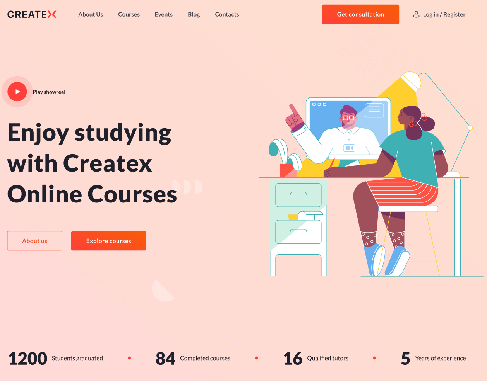
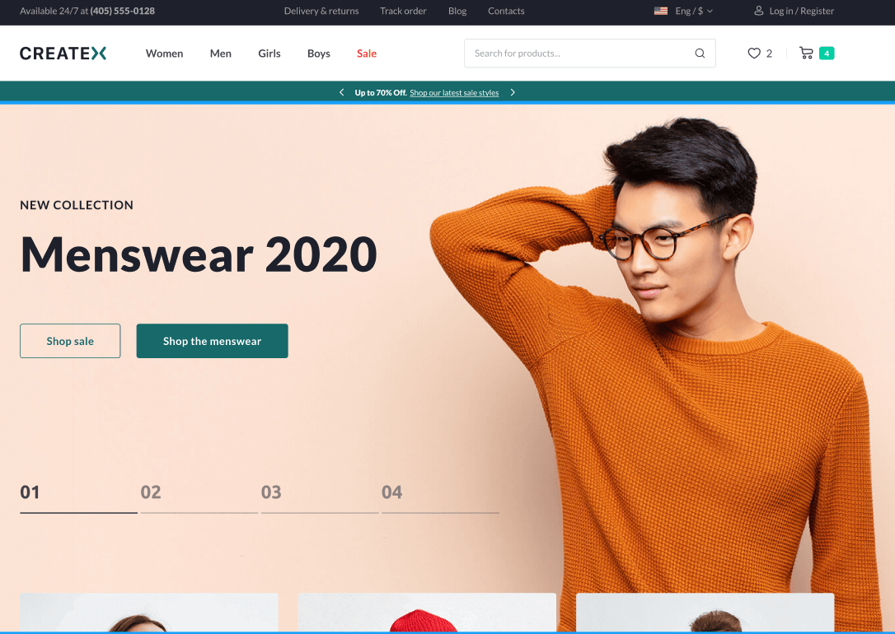
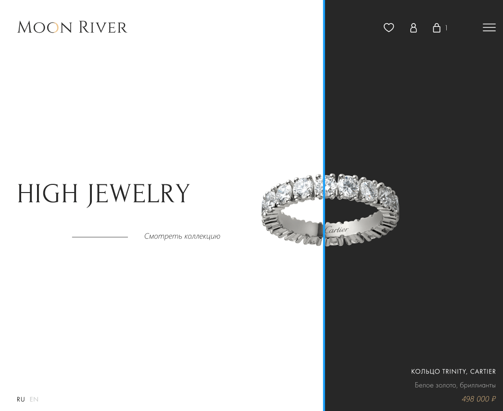
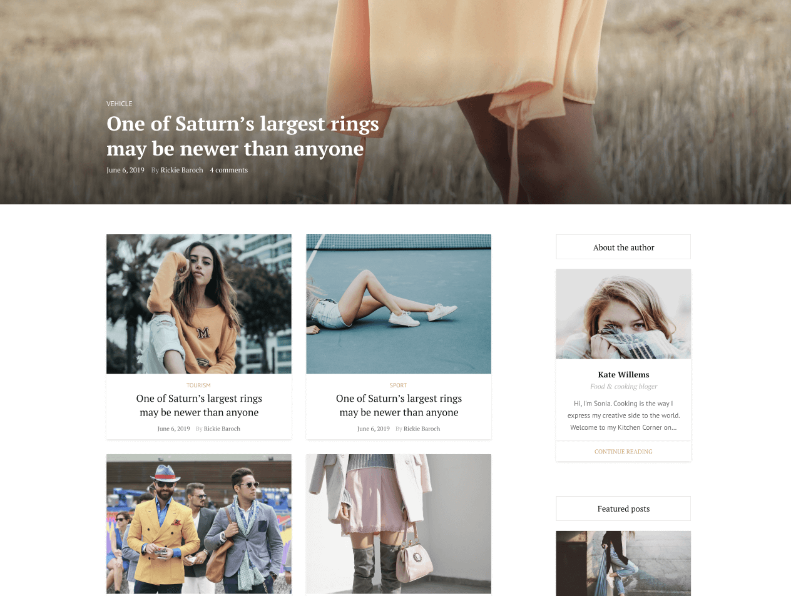

## Createx Online Courses

<figure>

<figcaption>Макет Createx Online Courses</figcaption>
</figure>

<a href="https://www.figma.com/file/2ZWX21Kfd6rLZVAm7hO8lz/Free-1.-Online-course?node-id=0%3A1" target="_blank">Ссылка на макет</a>

Многостраничный сайт про онлайн-курсы. Сами блоки несложные, но объем немаленький.

__Сложность:__ средняя

## Createx Online Shop

<figure>

<figcaption>Макет Createx Online Shop</figcaption>
</figure>

<a href="https://www.figma.com/file/vKHkRcH44r1TnsXy59cAmd/Free-4.-E-Commerce?node-id=0%3A1" target="_blank">Ссылка на макет</a>

Большой макет интернет-магазина с кучей элементов. Сложно, но полезно!

__Сложность:__ высокая

## Макет продуктового лендинга Moon River

<figure>

<figcaption>Макет Moon River</figcaption>
</figure>

<a href="https://www.figma.com/file/h8noBnTMtXKEm5Prwm59UN/Moon-River?node-id=0%3A1" target="_blank">Ссылка на макет</a>

Интересный макет для отработки из-за нестандартной сетки.

__Сложность:__ средняя

## Макет Fashion Blog

<figure>

<figcaption>Макет Fashion Blog</figcaption>
</figure>

<a href="https://www.figma.com/file/tGrUfiGxJo6Ahku54c7l5f/Fashion-Blog-Template?node-id=0%3A1" target="_blank">Ссылка на макет</a>

Небольшая страничка фэшн-блога. В целом ничего сложного

__Сложность:__ легкая

## Макет Medical

<figure>

<figcaption>Макет Medical</figcaption>
</figure>

<a href="https://www.figma.com/file/MEKCmlgypP6jUGlObpzLGG/Medical?node-id=0%3A1" target="_blank">Ссылка на макет</a>

Максимально простой макет для отработки.

__Сложность:__ низкая

Ну и пока все) буду еще искать для вас крутые макеты.

Удачи в верстке!)
